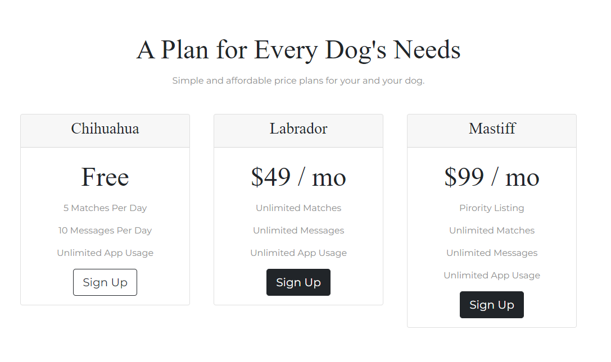

# Tindog

Tindog is a dating website for dogs and dog owners.Here I build a Home page like tindog with different section layouts. It is built using HTML, CSS, Bootstrap and jQuery.

- It includes -
- a homepage with navigation header
- stylish buttons
- section of features
- testimonials section with carousel items
- having pricing section with buttons
- links with social media in footer section

## Features

- Fully responsive design, works well on all devices
- Clean and modern layout
- modern layout with impressive styling

## Screenshots

## Getting Started

1. Clone the repository

   git clone https://github.com/ruksarganibhai/tindog.git

2. Open index.html file in browser

## Built With

- [HTML](https://developer.mozilla.org/en-US/docs/Web/HTML)
- [CSS](https://developer.mozilla.org/en-US/docs/Web/CSS)
- [Bootstrap](https://getbootstrap.com/)
- [jQuery](https://jquery.com/)

## Authors

- [Ruksar Ganibhai](https://github.com/ruksarganibhai)

## Acknowledgments

- Inspiration for design taken from [Tindog](https://tindog.co/)
- Images from [Google](https://www.google.com/)
